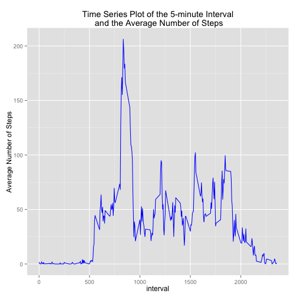
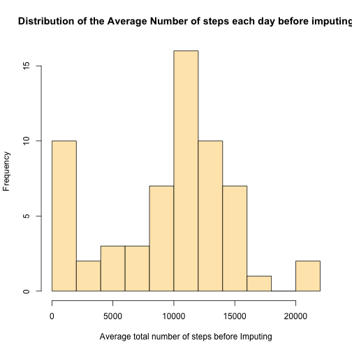
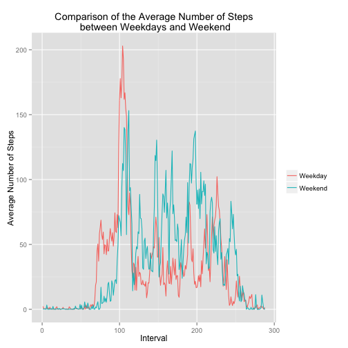

# Reproducible Research: Peer Assessment 1


### Loading and preprocessing the data


```r
rm(list=ls())                   
setwd("~/Coursera/DataScience/Reproducible_Research/RepData_PeerAssessment1")
df <- read.csv("activity.csv")
dfcopy = df
```

Take a look at the first 5 lines of data

```r
head(df)
```

```
##   steps       date interval
## 1    NA 2012-10-01        0
## 2    NA 2012-10-01        5
## 3    NA 2012-10-01       10
## 4    NA 2012-10-01       15
## 5    NA 2012-10-01       20
## 6    NA 2012-10-01       25
```


### What is mean total number of steps taken per day?

```r
# Transform date to date class
df$date <- as.Date(df$date)

# Convert interval to a factor
df$interval <- as.factor(df$interval)

# Extract levels of 5-min intervals
l <- levels(df$interval)

# Plot the histogram of the average number of steps each day
totalSteps <- tapply(df$steps, df$date, sum, na.rm=T)

hist(totalSteps, breaks = 10, col = "wheat1",
     main = "Distribution of the Average Number of steps each day")     ## Plot the histogram
```

 

### Calculate the mean and median total number of steps taken per day

```r
meanSteps <-as.integer(mean(totalSteps))
medianSteps <- as.integer(median(totalSteps))
```
#### Mean of the total number of steps is 9354
#### Median of the total number of steps is 10395

### What is the average daily activity pattern?
Make a time series plot (i.e. type = “l”) of the 5-minute intervals (x-axis) and the average number of steps taken, averaged across all days (y-axis)


```r
# Find the average number of steps grouped by interval
avg_Steps = tapply(df$steps, df$interval, mean, na.rm = T)
# Convert levels of intervals into numeric
interval <- as.numeric(l)
# Create the dataframe of the Interval and Steps columns
df1 <- data.frame(avg_Steps, interval)
library(ggplot2)
g <- ggplot(df1, aes(interval, avg_Steps))
g + geom_line(colour = "blue") +
        ggtitle("Time Series Plot of the 5-minute Interval\n and the Average Number of Steps") + 
        ylab("Average Number of Steps")
```

 

### Which 5-minute interval, on average across all the days in the dataset, contains the maximum number of steps?

```r
max_Steps <- max(avg_Steps)
index <- match(max_Steps, avg_Steps)
max_Value <- avg_Steps[index]
max_Steps_Interval <- as.numeric(names(max_Value))
max_Steps_Interval
```

```
## [1] 835
```
#### 5-minute interval that contains the maximum number of steps is 835

### Imputing missing values
Calculate and report the total number of missing values in the dataset (i.e. the total number of rows with NAs)

```r
missing_Values <- is.na(df[, 1])
number_NA <- sum(missing_Values)
# Total number of missing values
number_NA
```

```
## [1] 2304
```
#### Total number of missing values are 2304
### Devise a strategy for filling in all of the missing values in the dataset. The strategy does not need to be sophisticated. For example, you could use the mean/median for that day, or the mean for that 5-minute interval, etc.
#### Creat new dataframe and fill the NAs with the mean for that 5-minute interval

```r
# Change interval back to integer
df1<- df
df1$interval <- as.integer(df1$interval)
avg_Steps <- tapply(df1$step, df1$interval, mean, na.rm = TRUE)
df1[missing_Values, 1] <- avg_Steps[df1[missing_Values, 3]%/%100 * 12 + 
    (df1[missing_Values, 3]%%100)/5 + 1]
summary(avg_Steps)
```

```
##    Min. 1st Qu.  Median    Mean 3rd Qu.    Max. 
##    0.00    2.49   34.10   37.40   52.80  206.00
```


```r
head(df1)
```

```
##    steps       date interval
## 1 1.7170 2012-10-01        1
## 2 1.7170 2012-10-01        2
## 3 1.7170 2012-10-01        3
## 4 1.7170 2012-10-01        4
## 5 0.3396 2012-10-01        5
## 6 0.3396 2012-10-01        6
```

### Make a histogram of the total number of steps taken each day.


```r
hist(totalSteps, breaks = 10, col = "wheat1",
     main = "Distribution of the Average Number of steps each day before imputing",
     xlab="Average total number of steps before Imputing")
```

 

```r
day_sum1 <- tapply(df1$steps, df1$date, sum)
hist(day_sum1, breaks=10, col="royalblue",
     main="Histogram of the total number of steps taken each day\n with (NA filled",
     xlab="Average total number of steps after Imputing")
```

 


```r
# Summary before imputing
summary(totalSteps)
```

```
##    Min. 1st Qu.  Median    Mean 3rd Qu.    Max. 
##       0    6780   10400    9350   12800   21200
```

```r
#Summary after imputing
summary(day_sum1)
```

```
##    Min. 1st Qu.  Median    Mean 3rd Qu.    Max. 
##      41    6780   10400    9370   12800   21200
```

Q: Do these values differ from the estimates from the first part of the assignment?


A: The mean and median and the histogram are about the same. However the minimum and mean have slightly increased.

Q. What is the impact of imputing missing data on the estimates of the total daily number of steps?

A: The data is less biased.


### Calculate and report the mean and median total number of steps taken per day.

```r
mean(day_sum1)
```

```
## [1] 9370
```

```r
median(day_sum1)
```

```
## [1] 10395
```


## Are there differences in activity patterns between weekdays and weekends?

```r
# Extract weekdays
df1$Days <- weekdays(as.Date(as.character(df1$date)))
# Create a logical vector d where Days are Saturday or Sunday
d <- df1$Days == "Saturday" | df1$Days == "Sunday"
# Call Saturday and Sunday Weekend
df1$Days[d] = "Weekend"
# Call weekdays (Monday through Friday) Weekdays
df1$Days[!d] = "Weekday"

# Weekdays
df1WD <- df1[df1$Days == "Weekday", ]
# Weekend
df1WE <- df1[df1$Days == "Weekend", ]

# Convert levels of interval into numeric for weekdays
IntervalWD <- as.numeric(levels(as.factor(df1WD$interval)))
# Convert levels of interval into numeric for the weekend
IntervalWE <- as.numeric(levels(as.factor(df1WE$interval)))

# Average number of steps during weekdays
avgWD <- tapply(df1WD$steps, df1WD$interval, mean)
# Average number of steps during the weekend
avgWE <- tapply(df1WE$steps, df1WE$interval, mean)

# Data frame combining average number of steps and interval during weekdays
dfWD <- data.frame(avgWD, IntervalWD)
# Data frame combining average number of steps and interval during weekends
dfWE <- data.frame(avgWE, IntervalWE)
```

#### Plot the 5-minute interval (x-axis) and the average number of steps taken, averaged across all weekday days or weekend days (y-axis).

```r
# Add a column to the data frames that include weekdays and weekend days
dfWD$wDays <- rep("Weekday", nrow(dfWD))
dfWE$wDays <- rep("Weekend", nrow(dfWD))
# Rename column names to match
colnames(dfWD) <- c("Steps", "Interval", "wDays")
colnames(dfWE) <- c("Steps", "Interval", "wDays")
# rbind the dataframes
df <- rbind(dfWD, dfWE)
# Convert wDays column into a factor
df$wDays <- factor(df$wDays)
# Using ggplot2 package
library(ggplot2)
g <- ggplot(df, aes(Interval, Steps, fill = wDays, colour = wDays))
g + geom_line() + labs(colour = "") + 
        ggtitle("Comparison of the Average Number of Steps\n between Weekdays and Weekend") + 
        ylab("Average Number of Steps")
```

 

The maximum average number of steps during weekdays is higher than weekends. However on average there seems to more activity on weekends. On all days most activities seem to take place between 0830 and 0930 hours. The subject probably goes for a walk during this time. There is no activity between 2300 hrs and 0500 hrs, since the subject is probably asleep. In addition there is more activity during the day between 1000 and 2000 hours when the subject is awake and going about
his/her daily activities.
